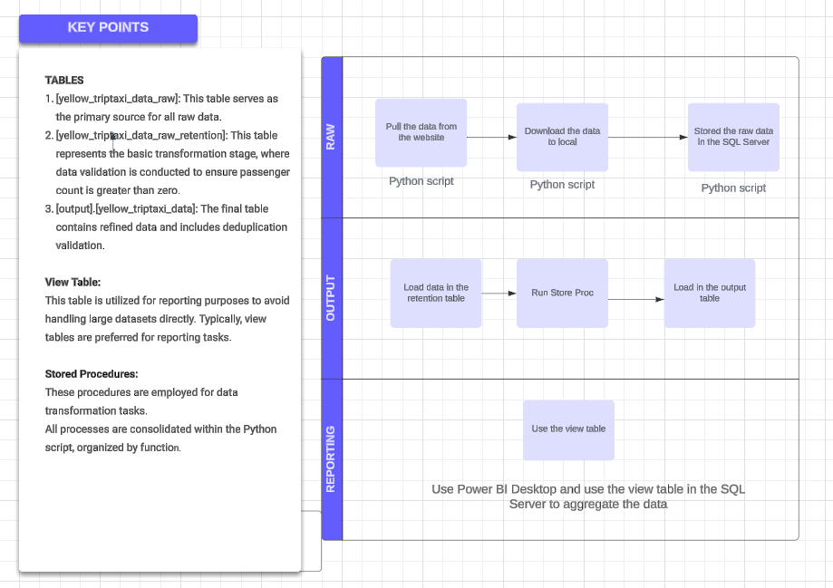

# Yellow Trip taxi Data

## Project Overview 
Yellow taxi trip records include fields capturing pick-up and drop-off dates/times, 
pick-up and drop-off locations, trip distances, itemized fares, rate types, payment types, 
and driver-reported passenger counts. The data used in the attached datasets were collected 
and provided to the NYC Taxi and Limousine Commission (TLC) by technology providers 
authorized under the Taxicab & Livery Passenger Enhancement Programs (TPEP/LPEP). 
The trip data was not created by the TLC, and TLC makes no representations as to the 
accuracy of these data.

## Set-up instruction 
1. Install Pycharm IDE
2. Install SQL Server
3. Set-up ODBC
4. Install Power BI Desktop

Requirements and Dependency to install with pycharm IDE
1. pip install requests beautifulsoup4
2. pip install pyarrow
3. pip install beautifulsoup4
4. pip install pandas
5. pip install pyodbc
6. pip install pyodbc
7. pip install pymysql

## Execution Instructions

1. Begin by installing PyCharm as your integrated development environment (IDE) for running the Python script.
2. Within the PyCharm IDE, configure the Python environment. Typically, this process will automatically install necessary components; please be patient until it completes.
3. Install SQL Server.
4. COnfigure your ODBC
5. Configure your database.
6. Refer to the SQL Scripts folder for guidance on creating new tables with the same data format.
7. After completing all setup steps, update the `config.ini` file according to the SQL server name.
8. Execute the main Python script.

## Discussion 
1. The challenge lies in determining which technologies to utilize. 
2. My approach has been fairly straightforward: extracting data from its raw form, 
downloading it locally, storing it in the SQL server, and generating reports based on 
the resulting view table.

## Technology In Use 
1. Python
2. SQL Server
3. Power Bi Desktop

## Process Flow Diagram 
The flowchart illustrates the progression
from initial data processing through output generation to visualization for reporting. Pay close attention to the critical details.

## Sample Visualization

1. [Link for pbix report](yellowtriptaxi/visualization/yellow_trip_data.pbix)

2. [Data Dictionary](yellowtriptaxi/Docs/data_dictionary_trip_records_yellow.pdf)

3. Sample Visualization for the total amount per day. 

